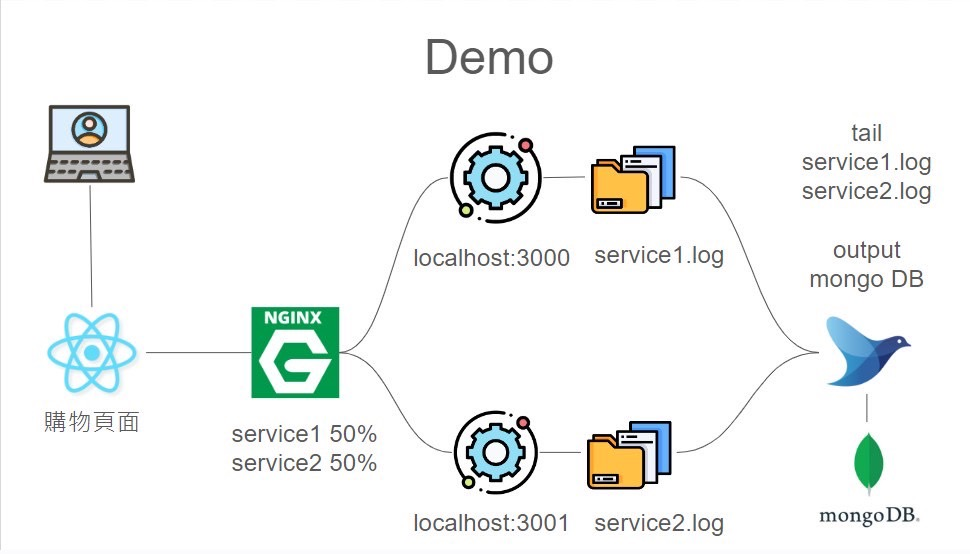

# Final Project：Fluentd實際應用
### 🙋‍♀️ 組員：林思岑、陳湘婷、李姿瑩


## 🔸 專案應用
### Fluentd 應用於購物平台之資料收集並以特定格式儲存於資料庫

## 🔸 專案架構
- 

## 🔸 架構說明
### - 前端網頁將使用者資訊(包含：使用者名稱、商品名稱、數量、金額與總金額)，傳送至後端程式進行處理
### - 使用 Nginx 進行負載平衡，將多位使用者的資訊分別傳送至 service1 和 service2 ，當接收到訊息後，寫入各自 log 檔中
### - 使用 Fluentd 並安裝 MongoDB 套件，將日誌集中管理，最後儲存至資料庫

---

## 🧭 專案設定指南

### - 🛠 需求工具及程式
### ✔  前端網頁
### ✔  後端程式
### ✔  Nginx
### ✔  Fluentd
### ✔  MongoDB

---

### 🔺 **前端網頁**
- 使用React開發簡易的訂購商品網頁，用於發送資料到後端
- 已準備好 `frontend` 資料夾，它包含本專案的網頁原始碼

### 安裝與執行
```
1. 下載並安裝 [Node.js](https://nodejs.org/)
2. 使用cmd進入frontend的根目錄
3. 執行 npm install
4. 執行 npm start 可開啟網頁
```

### 補充說明
- 由於port佔用的問題，建議最後再開啟網頁

---

### 🔺 **後端程式**
- 使用Node.js架設兩個後端程式，接收前端發送的資料並儲存於log
- 已準備好 `backend` 資料夾，它包含本專案的後端原始碼

### 安裝與執行
```
1. 下載並安裝 [Node.js](https://nodejs.org/)
2. 使用cmd進入backend的根目錄
3. 執行 npm install
4. 請依據自己的需求調整儲存路徑，編輯 index.js 與 index2.js 的「第38行」程式碼
5. 執行 node index.js 開啟 server1
6. 執行 node index2.js 開啟 server2
```

### 補充說明
- 由於port佔用的問題，請在前端網頁開啟前，確認佔用 3000 與 3001 port
- 注意更改儲存 log 的路徑，以確保後續 Fluentd 可讀取到 log
- `index.js` 和 `index2.js` 提供 post 方法，用於接收訂單訊息，並寫入各自的 log 檔

---

### 🔺 **Nginx**
- 使用 Nginx 作為伺服器負載平衡
- 已準備好 `nginx.config` 設定檔，它包含本專案的配置設定

### 安裝與設定
```
1. 下載並安裝 Nginx
2. 將 `nginx.config` 文件放置於 Nginx 的根目錄下
3. 根據 `nginx.config` 的資訊配置 Nginx
4. 重新開啟 Nginx ，使配置生效
```
### 補充說明
使用 Nginx 進行負載平衡，配置如下：
- service1 啟動於 `localhost:3000`
- service2 啟動於 `localhost:3001`
- Nginx 會輪流將請求傳送至 service1 和 service2

---

### 🔺 **Fluentd**
- 使用 Fluentd 作為日誌管理工具
- 已準備好 `fluentd.config` 設定檔，它包含了本專案的配置設定

### 安裝與設定
- 官方網站下載 Fluentd
- 調整 config 檔案中 source 路徑，需與後端程式 log 的儲存路徑相同
- 安裝 Fluentd 的 MongoDB 套件
- 設定 MongoDB 資訊，包含位置、database、collection

### 補充說明
- 當 service1 或 service2 寫入 log 檔時，Fluentd 會監控並將新增的段落匯入 MongoDB 所設定的 Database 與 Collection

---

### 🔺 **MongoDB**
- 使用 MongoDB 作為最後儲存日誌的資料庫

### 安裝與設定 
- 官方網站下載 MongoDB
- 設定 MongoDB 資訊，包含位置、database、collection

---

## 💡 Demo 操作步驟
- 請確認上述工具與程式皆已安裝與設定完成
    1. 確認 MongoDB、Fluentd、Nginx 皆可以正常運作
    2. 開啟後端程式，server1 和 server2
    3. 開啟前端網頁，購物網頁，可開多個分頁
    4. 輸入Name(購買者姓名)，點選Login進入購物頁面
    5. 選擇所需購買的商品，並加入購物車
    6. 購物完成後，送出訂單，即將資料傳送至後端
    7. 在送出訂單後，可到後端cmd查看接收到的資訊
    8. 連續發送訂單且訂單數量建議大於5筆，以利使系統順利觸發負載平衡機制
    9. 到 MongoDB 查看資料是否有依據 Fluentd 所設定的格式整理並儲存

    ## 🔷🔹🔺🔻📍✔